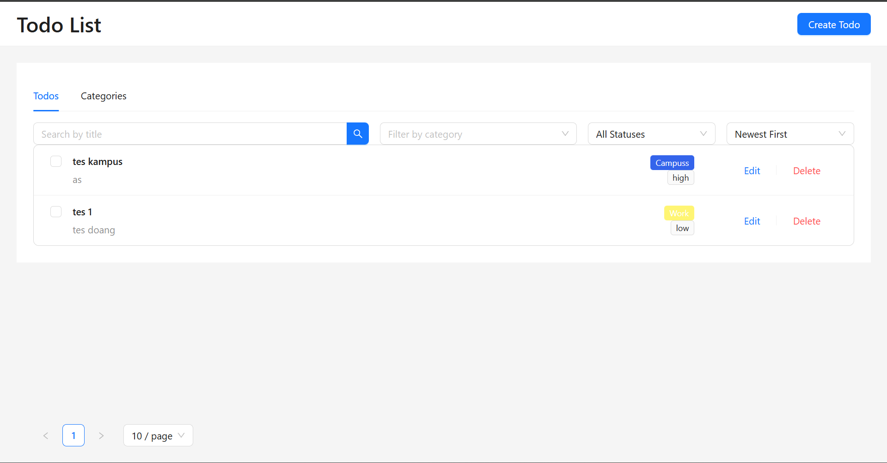
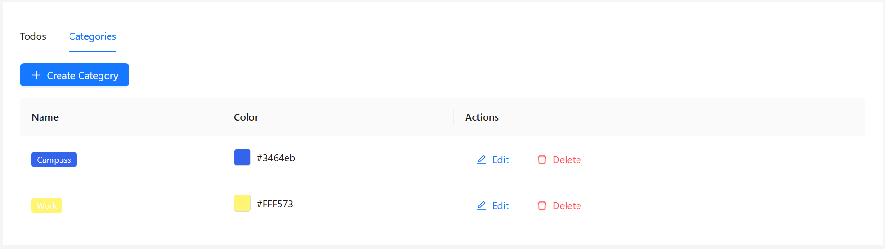
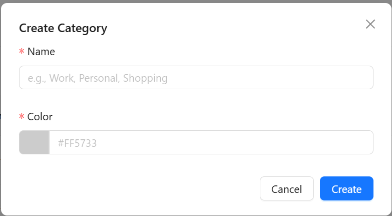

# Todo List Frontend

This document provides a comprehensive guide for new team members to set up, run, and understand the frontend for the Todo List application.

## Screenshoot
### 1. Homepage


### 2. Create todo


### 3. Category page


### 4. Create category


## 1. Project Overview

This project is the frontend client for the Todo List application, built as a modern Single-Page Application (SPA) using **React** and **TypeScript**. It provides a clean, interactive, and responsive user interface for managing todos and their associated categories.

The application is built with a focus on modern React practices, including hooks for state and side effects, and a centralized context for managing global application state.

### Core Technologies

-   **Framework**: React (v19) with TypeScript
-   **Build Tool**: Vite
-   **Package Manager**: Bun
-   **UI Library**: Ant Design (`antd`)
-   **Routing**: React Router (v7)
-   **State Management**: React Context API with `useReducer`
-   **API Communication**: `axios`

### Features

-   **Full Todo Management**: Create, read, update, and delete todos.
-   **Category Management**: A separate interface to create, read, update, and delete categories.
-   **Advanced Filtering & Sorting**: Filter todos by search term, completion status, or category. Sort by creation date, priority, or title.
-   **Centralized State**: A global `TodoContext` manages all application data, ensuring a single source of truth and predictable state updates.
-   **API Integration**: Seamlessly communicates with the backend Go API. Includes a proxy for easy local development.
-   **Responsive Design**: The UI is designed to work across desktop, tablet, and mobile devices.

---
## 2. Project Structure

The project follows a standard structure for a modern React application.

```
frontend/
├── app/                  # Main application source code
│   ├── components/       # Reusable React components (e.g., TodoList, TodoForm)
│   ├── context/          # Global state management (e.g., TodoContext.tsx)
│   ├── routes/           # Page components for each route (e.g., home.tsx)
│   ├── services/         # API layer for backend communication (api.ts)
│   ├── types.ts          # TypeScript type definitions for data models
│   ├── root.tsx          # The root React component, sets up providers and layout
│   └── index.css         # Global styles and TailwindCSS imports
├── public/               # Static assets (e.g., favicon.ico)
├── bun.lockb             # The lockfile for Bun, ensuring consistent installs
├── package.json          # Project metadata, dependencies, and scripts
├── tsconfig.json         # TypeScript configuration
└── vite.config.ts        # Configuration for the Vite development server and build tool
```

---

## 3. Setup and Installation

Follow these steps to get the frontend running on your local machine.

### Prerequisites

1.  **Bun**: You must have Bun installed. You can download it from [bun.sh](https://bun.sh/).

2.  **Running Backend API**: **This is crucial.** The frontend is designed to communicate with the backend API. You must have the [backend service](../backend) running first. By default, the frontend expects the backend to be available at `http://localhost:4000`.

### Step-by-Step Instructions

1.  **Navigate to the Frontend Directory**
    Open your terminal and navigate into the project's `frontend` directory.
    ```bash
    # Assuming you are at the root of the project
    cd frontend
    ```

2.  **Install Dependencies**
    Run the following command to install all the necessary packages.
    ```bash
    bun install
    ```
    This will create a `node_modules` directory with all the required libraries.

---

## 4. How to Run the Application Locally

Once you have completed the setup, you can start the local development server.

1.  **Ensure the Backend is Running**
    Before starting the frontend, make sure you have the backend server running on `http://localhost:4000`.

2.  **Start the Frontend Dev Server**
    Run the `dev` script defined in `package.json`.
    ```bash
    bun run dev
    ```

    This command starts the Vite development server with Hot Module Replacement (HMR) enabled, which provides a fast and efficient development experience.

    You should see output similar to this:
    ```
    VITE v7.1.7  ready in 320 ms

    ➜  Local:   http://localhost:5173/
    ➜  Network: use --host to expose
    ```

3.  **Open the Application**
    You can now open your web browser and navigate to **http://localhost:5173** to see the application running.